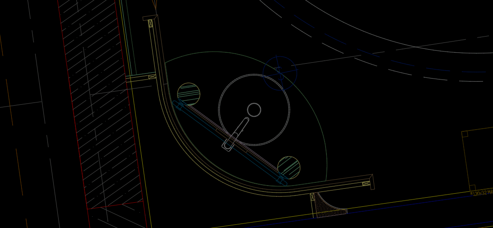
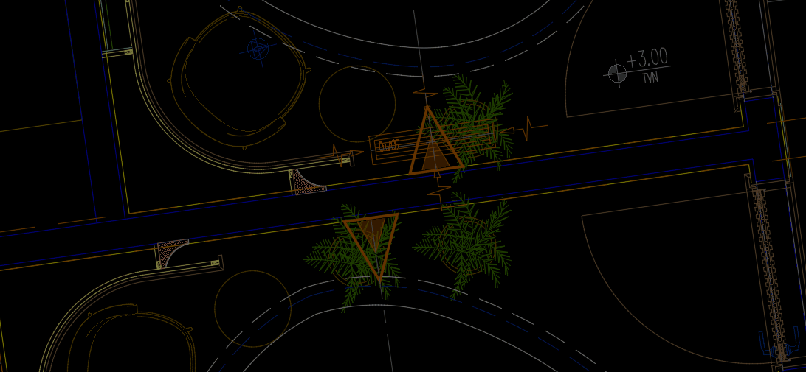

# AutoCAD-Hasteners
Collection of ACAD tools for a better walkthrough...

## Basic Explanation / Usage of Commands :

#### BLOCKSIMPLFY    
-Function        : Gets block's properties, and assign to entities.\
-Purpose         : Shortening Layer Table, handy when superposing multiple sub-contractor projects.
                
#### SEPARATEBLOCKS  
-Function       : Wblocks all blocks. (Not nested ones.)\
-Purpose        : For inspection of objects separately, beneficial for file optimisation.
                 
#### NEWLAYERACTIVE  
-Function       : Simply creates a layer, name it and makes it current.\
-Purpose        : For skipping layer dialogs when necessary. Will be handy if you use temporary layers a lot.
                 
#### OPENJOINT      
-Function       : Creates half-open joint from two lines. (Only for right-angled & connected ones.)\
-Purpose        : As its name implies.
                 

               
#### MCOPY            
-Function      : Multiple copy allows to determine duplication number after all.\
-Benefit       : Better handling.
                  
#### MATCHPROPREVERSE : 
-Function      : Alternative method for object property injection.\
-Purpose       : Changing object & subject selection order when necessary.
                 
#### POINTDEPICTOR    
-Function      : Instant depiction of points on screen.\
-Purpose       : In order to skip pdmode dialog/lags.
                

                
#### ZOOMEACH         
-Function      : Zoom to each element of current selection one by one.\
-Purpose       : Finding elements in messy drawings quickly.
                
#### POLYCENTROID         
-Function      : Finds the geometric centre of polylines.\
-Purpose       : Drafting.

#### EXTRACTNESTEDOBJECT         
-Function      : Extract the selected object from its chain of blocks.\
-Purpose       : Skipping the block editor and reference editing on workspace process.

#### EXTRACTNESTEDBLOCK         
-Function      : Extract the selected objects immediate block from its chain of blocks.\
-Purpose       : Skipping the block editor and reference editing on workspace process.

#### DETECTNONCOPLANARARCSANDCIRCLES         
-Function      : Detect non-coplanar arcs and circles in the drawing.\
-Purpose       : Compliance check of vendor projects.

#### DETECTNONCOPLANARBLOCKS         
-Function      : Detect non-coplanar blocks in the drawing.\
-Purpose       : Compliance check of vendor projects.
                  
#### SELECTSIMILARINVIEW         
-Function      : Select similar objects only in current view boundaries by using built-in SELECTSIMILAR settings.\
-Purpose       : Better control of partial selection in large models.

#### CLOSEALLUNSAVED         
-Function      : Closes all documents in the active session without saving.\
-Purpose       : Instant termination of the session without bothering/waiting any dialogues.

#### WIPEOUTDELETEHERE         
-Function      : Deletes all wipeout objects from the current space.\
-Purpose       : Simplifying 3rd-party drawings.

#### WIPEOUTDELETEBLOCK         
-Function      : Deletes all wipeout objects from a selected block and its nested chain of blocks.\
-Purpose       : Simplifying 3rd-party drawings.

#### ROTBLOCKPERPENDICULAR         
-Function      : Rotates selected blocks according to a line/polyline normal on their base points.\
-Purpose       : Instant object manipulation.

#### ROTBLOCK180         
-Function      : Flips selected blocks on their base boints.\
-Purpose       : Instant object manipulation.

#### TEXTDELETEBLOCK         
-Function      : Deletes all text & mtext objects from a selected block and its nested chain of blocks.\
-Purpose       : Simplifying 3rd-party drawings.

#### GETNESTEDLAYERNAMES         
-Function      : Retrieves layer names of a nested object and its nested chain of blocks.\
-Purpose       : XREF management.

#### SPLINETOPOLYLINE         
-Function      : Convert spline objects to 2D polyline similar to flatshot.\
-Purpose       : Simplifying 3rd-party drawings.
